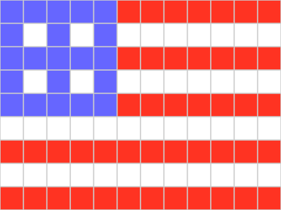
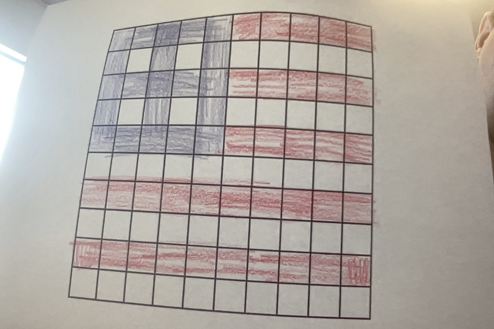

# Pixel Art
## Binary

`0000 1100
0000 1001
0000 1100
011001101111 011001101111 011001101111 011001101111 011001101111 111100110010 111100110010 111100110010 111100110010 111100110010 111100110010 111100110010 
011001101111 111111111111 011001101111 111111111111 011001101111 111111111111 111111111111 111111111111 111111111111 111111111111 111111111111 111111111111 
011001101111 011001101111 011001101111 011001101111 011001101111 111100110010 111100110010 111100110010 111100110010 111100110010 111100110010 111100110010 
011001101111 111111111111 011001101111 111111111111 011001101111 111111111111 111111111111 111111111111 111111111111 111111111111 111111111111 111111111111 
011001101111 011001101111 011001101111 011001101111 011001101111 111100110010 111100110010 111100110010 111100110010 111100110010 111100110010 111100110010 
111111111111 111111111111 111111111111 111111111111 111111111111 111111111111 111111111111 111111111111 111111111111 111111111111 111111111111 111111111111 
111100110010 111100110010 111100110010 111100110010 111100110010 111100110010 111100110010 111100110010 111100110010 111100110010 111100110010 111100110010 
111111111111 111111111111 111111111111 111111111111 111111111111 111111111111 111111111111 111111111111 111111111111 111111111111 111111111111 111111111111 
111100110010 111100110010 111100110010 111100110010 111100110010 111100110010 111100110010 111100110010 111100110010 111100110010 111100110010 111100110010`

## Pixelated image

## Drawing

