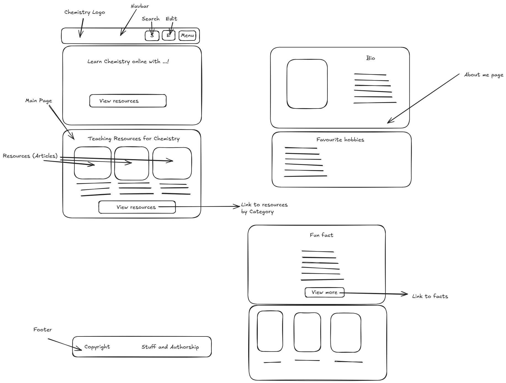

# Development Process
## TODO
* Write a main page
* Take client's input into account
* Create a main page of website
* Create editor's Capabilities.
* Continue working with client.

## 12 January
### Design

### Main Page
- Logo of ...
- Short descriptive hero
- Online articles
- Footer
### Accessibility page

### Resources
- Fun fact
- List of ugc

### About page
- Bio
- Hobbies
- Interests

### Details
- Light green background
- Font size text 14px
- Headline 18px;
- Black font
- White font for contrast
- Search bar

## 14 January

## Todo
- Replace Fun Fact Card with "About Me"
- Include "Fun Facts" to Menu Dropdown
- Change "Simple" To "Fun
- Change font typeface to Roboto

## 15 January
- Scrapped `data-mode=dark` entirely
- Split "About Me" and "Articles" into two parts because grids did not resize.
- Added Darkmode.
- Adapted for mobiles.